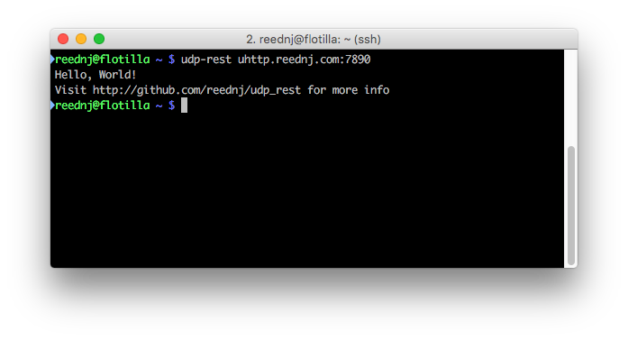

# REST over UDP

REST is a useful pattern for client-server interaction, but for simple scenarios setting up an entire HTTP stack is overkill. This gem provides a classes to allow for REST over UDP using a http-like protocol, as well as a curl like app for making requests from the command line.

The request and response size is limited 512 bytes, so this model is only appropriate for certain apis. 

## Try it out

There is a udp rest server running on uhttp.reednj.com, port 7890.

	gem install udp_rest
	udp-rest uhttp.reednj.com:7890

Some other urls to try are:

 - uhttp.reednj.com:7890/time/iso
 - uhttp.reednj.com:7890/time/unix
 - uhttp.reednj.com:7890/count

## Client

Use the `UDPRest::Client` class to make requests programmatically

	UDPRest::Client.get('uhttp://uhttp.reednj.com:7890')
	UDPRest::Client.post('uhttp://uhttp.reednj.com:7890')

## Server

Use the `UDPRest::Server` class to create simple sinatra-style servers

	UDPRest::Server.new(:port => 7890) do |s|
		s.get '/' do
			'hello, world!'
		end

		s.get '/time' do
			Time.now.to_s
		end

		s.get '/echo' do |request|
			params['data'].to_s
		end
	end
